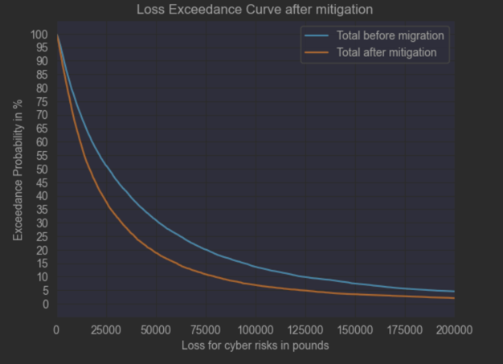
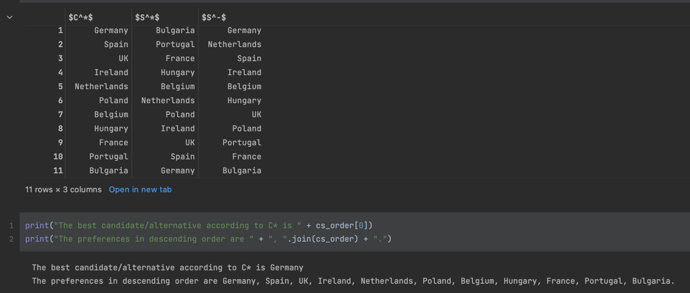

# Description
This repository contains all the artefacts that were produced during the module security and risk management in university of Essex.


# Getting Started 🚀

### Prerequisites for running the Notebooks for the simulations
* <a href=https://www.python.org/downloads/release/python-370/> Python 3.7 or Greater</a>
* <a href=https://pip.pypa.io/en/stable/installation/> pip 21.3.1 or Greater</a>
* <a href=https://jupyter.org/install/> Jupyter Lab</a>

After installing the requirements, run the following commands in order
```bash
# creates python virtual environment for the project
python -m venv ./venv 

# activates virtual environment; this is on Mac or Linux
source ./venv/bin/activate 

# This is for windows (Using Powershell)
.\venv\Scripts\activate.bat 

# upgrade pip to get the latest packages
python -m pip install --upgrade pip 

#Is used to check if the virtual environment is being used 
pip -V  

# Install all required dependencies
pip install -r requirements.txt 

```

## Quantitative Risk Analysis

Enumerated the potential risks to the quality and supply chain for the Pampered Pets using monte-carlo simulations to
assess the cyber threat loss for the company and the TOPSIS, a Multiple Criteria Decision-Making (MCDM) processes to evaluate
and rank the best possible location to open an automated warehouse internationally.

### Monte-Carlo Simulation


The MCS was carried out in Python with all the values, calculated the probability exceedance curve and plotted to find the probability for the loss of each threat and the total.
The simulation can be found in [mcs notebook](./simulations/mcs_cyber_risks.ipynb).

### TOPSIS 


To investigate the risks of the digitalisation of the supply chain, we used two methods, the Technique for Order of Preference by 
Similarity to Ideal Solution (TOPSIS) [TOPSIS notebook](./simulations/topsis-implementation.ipynb).

